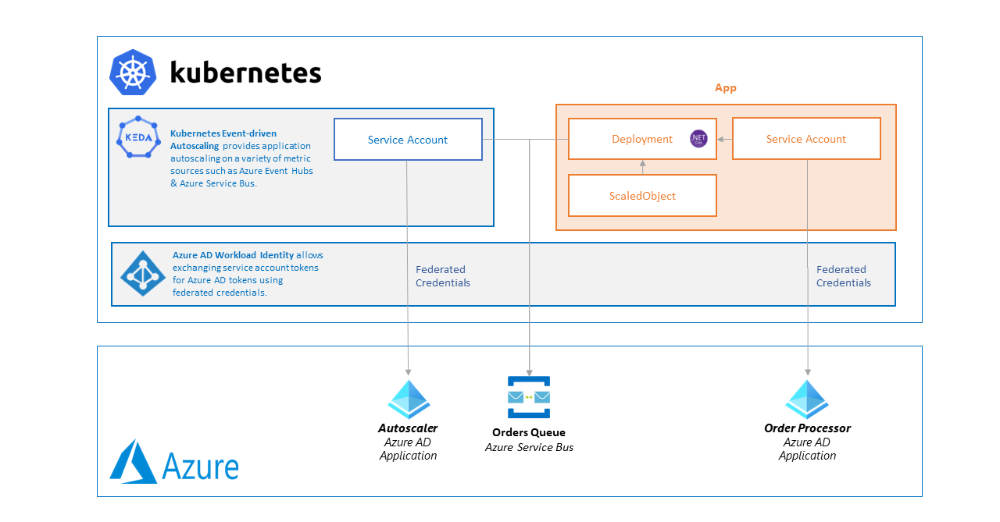

# Autoscaling with the KEDA add-on and workload identity on AKS

> Estimated Duration: 60 minutes
>> **NOTE:** You need to fulfill these [requirements](environment-setup.md) and [AKS Basic Cluster](aks-basic-cluster.md) to complete this exercise.

This lab shows you how to securely scale your applications with the Kubernetes Event-driven Autoscaling (KEDA) add-on and workload identity on Azure Kubernetes Service (AKS).



## Reference

* [Securely scale your applications using the KEDA add-on and workload identity on AKS](https://learn.microsoft.com/en-us/azure/aks/keda-workload-identity)
* [Simplified application autoscaling with the KEDA add-on](https://learn.microsoft.com/en-us/azure/aks/keda-about)
* [.NET Core worker processing Azure Service Bus Queue scaled by KEDA with Azure Workload Identity](https://github.com/kedacore/sample-dotnet-worker-servicebus-queue/blob/main/workload-identity.md)

## Setup

In a terminal, export variables required for this lab (if not already exported - update `INITIALS` and `LOCATION` accordingly):

```bash
INITIALS=abc
CLUSTER_NAME=aks-$INITIALS
RG=aks-$INITIALS-rg
LOCATION=eastus2
```

If not already connected, connect to the cluster from your local client machine.

```bash
az aks get-credentials --name $CLUSTER_NAME -g $RG
```

## Enable Application Routing add-on

Run the following command to enable KEDA, workload identity and oidc issuer add-ons:

```bash
az aks update --name $CLUSTER_NAME --resource-group $RG \
  --enable-workload-identity --enable-oidc-issuer --enable-keda
```

Validate the deployment was successful and make sure the cluster has KEDA, workload identity, and OIDC issuer enabled using this command:

```bash
az aks show --name $CLUSTER_NAME --resource-group $RG \
--query "[workloadAutoScalerProfile, securityProfile, oidcIssuerProfile]"
```

## Create an Azure Service Bus

Create an Azure Service Bus namespace using this command.

```bash
SB_NAME=kedasb
SB_HOSTNAME="${SB_NAME}.servicebus.windows.net"

az servicebus namespace create --name $SB_NAME -g $RG --disable-local-auth
```

Create an Azure Service Bus queue:

```bash
SB_QUEUE_NAME=my-queue

az servicebus queue create -g $RG --name $SB_QUEUE_NAME --namespace $SB_NAME
```

## Create a managed identity

Create a managed identity using this command:

```bash
MI_NAME=keda-appid
MI_CLIENT_ID=$(az identity create --name $MI_NAME -g $RG --query "clientId" --output tsv | tr -d '\r')
```

Get the OIDC issuer URL:

```bash
AKS_OIDC_ISSUER=$(az aks show --name $CLUSTER_NAME -g $RG --query oidcIssuerProfile.issuerUrl --output tsv | tr -d '\r')
```

Create a federated credential between the managed identity and the namespace and service account used by the workload. The `NAMESPACE` variable corresponds to the kubernetes namespace where the application will be deployed later on:

```bash
FED_WORKLOAD=fed-workload
NAMESPACE=keda-demo

az identity federated-credential create --name $FED_WORKLOAD --identity-name $MI_NAME -g $RG \
--issuer $AKS_OIDC_ISSUER --subject system:serviceaccount:$NAMESPACE:$MI_NAME --audience api://AzureADTokenExchange
```

Create a second federated credential between the managed identity and the namespace and service account used by the keda-operator:

```bash
FED_KEDA=fed-keda

az identity federated-credential create --name $FED_KEDA -g $RG --identity-name $MI_NAME \
    --issuer $AKS_OIDC_ISSUER \
    --subject system:serviceaccount:kube-system:keda-operator \
    --audience api://AzureADTokenExchange
```

## Create role assignments

Get the object ID for the managed identity:

```bash
MI_OBJECT_ID=$(az identity show --name $MI_NAME -g $RG --query "principalId" --output tsv | tr -d '\r')
```

Get the Service Bus namespace resource ID:

```bash
SB_ID=$(az servicebus namespace show --name $SB_NAME -g $RG --query "id" --output tsv | tr -d '\r')
```

Assign the Azure Service Bus Data Owner role to the managed identity:

```bash
az role assignment create --role "Azure Service Bus Data Owner" \
--assignee-object-id $MI_OBJECT_ID --assignee-principal-type ServicePrincipal --scope $SB_ID
```

## Enable Workload Identity on KEDA operator

After creating the federated credential for the `keda-operator` ServiceAccount, you will need to manually restart the `keda-operator` pods to ensure Workload Identity environment variables are injected into the pod:

```bash
kubectl rollout restart deploy keda-operator -n kube-system
```

Confirm the `keda-operator` pods restart:

```bash
kubectl get pod -n kube-system -l app=keda-operator -w
```

Once you've confirmed the keda-operator pods have finished rolling hit `Ctrl+c` to break the previous watch command then confirm the Workload Identity environment variables have been injected:

```bash
KEDA_POD_ID=$(kubectl get pod -n kube-system -l app.kubernetes.io/name=keda-operator -o jsonpath='{.items[0].metadata.name}')
kubectl describe pod $KEDA_POD_ID -n kube-system | grep AZURE
```

You should see output similar to this:

```bash
AZURE_CLIENT_ID:
AZURE_TENANT_ID:               xxxxxxxx-xxxx-xxxx-xxxx-xxxxxxxxxxx
AZURE_FEDERATED_TOKEN_FILE:    /var/run/secrets/azure/tokens/azure-identity-token
AZURE_AUTHORITY_HOST:          https://login.microsoftonline.com/
```

## Deploy Consumer application

Create a test namespace:

```bash
kubectl create namespace $NAMESPACE
```

Deploy a KEDA TriggerAuthentication resource that includes the User-Assigned Managed Identity's Client ID:

```bash
kubectl apply -n $NAMESPACE -f - <<EOF
apiVersion: keda.sh/v1alpha1
kind: TriggerAuthentication
metadata:
  name: azure-servicebus-auth
spec:
  podIdentity:
    provider:  azure-workload
    identityId: $MI_CLIENT_ID
EOF
```

Create a new Service account to link the Managed Identity as workload identity:

```bash
kubectl apply -n $NAMESPACE -f - <<EOF
apiVersion: v1
kind: ServiceAccount
metadata:
  annotations:
    azure.workload.identity/client-id: $MI_CLIENT_ID
  name: $MI_NAME
EOF
```

Next deploy consumer job:

```bash
kubectl apply -n $NAMESPACE -f - <<EOF
apiVersion: keda.sh/v1alpha1
kind: ScaledJob
metadata:
  name: myconsumer-scaledjob
spec:
  jobTargetRef:
    template:
      metadata:
        labels:
          azure.workload.identity/use: "true"
      spec:
        serviceAccountName: $MI_NAME
        containers:
        - image: ghcr.io/azure-samples/aks-app-samples/servicebusdemo:latest
          name: myconsumer
          env:
          - name: OPERATION_MODE
            value: "consumer"
          - name: MESSAGE_COUNT
            value: "10"
          - name: AZURE_SERVICEBUS_QUEUE_NAME
            value: $SB_QUEUE_NAME
          - name: AZURE_SERVICEBUS_HOSTNAME
            value: $SB_HOSTNAME
        restartPolicy: Never
  triggers:
  - type: azure-servicebus
    metadata:
      queueName: $SB_QUEUE_NAME
      namespace: $SB_NAME
      messageCount: "10"
    authenticationRef:
      name: azure-servicebus-auth
EOF
```

Verify scaled job is created:

```bash
kubectl describe scaledjob myconsumer-scaledjob -n $NAMESPACE
```

Output should show scaler is ready:

```bash
  Normal   KEDAScalersStarted  30s               scale-handler  Started scalers watch
  Normal   ScaledJobReady      30s               keda-operator  ScaledJob is ready for scaling
  Warning  KEDAScalerFailed    29s               scale-handler  context canceled
  Normal   KEDAScalersStarted  0s (x2 over 30s)  scale-handler  Scaler azure-servicebus is built.
```

Finally create publisher application:

```bash
kubectl apply -n $NAMESPACE -f - <<EOF
apiVersion: batch/v1
kind: Job
metadata:
  name: myproducer
spec:
  template:
    metadata:
      labels:
        azure.workload.identity/use: "true"
    spec:
      serviceAccountName: $MI_NAME
      containers:
      - image: ghcr.io/azure-samples/aks-app-samples/servicebusdemo:latest
        name: myproducer
        resources: {}
        env:
        - name: OPERATION_MODE
          value: "producer"
        - name: MESSAGE_COUNT
          value: "100"
        - name: AZURE_SERVICEBUS_QUEUE_NAME
          value: $SB_QUEUE_NAME
        - name: AZURE_SERVICEBUS_HOSTNAME
          value: $SB_HOSTNAME
      restartPolicy: Never
EOF
```

Check for running pods:

```bash
 kubectl get pods -n $NAMESPACE
 ```

You will initially see one `myproducer` completed job shortly followed by 10 `myconsumer` completed pods:

```bash
NAME                               READY   STATUS      RESTARTS   AGE
myconsumer-scaledjob-4787f-5r6mv   0/1     Completed   0          30s
myconsumer-scaledjob-6v56h-hztg6   0/1     Completed   0          30s
myconsumer-scaledjob-886bz-q6kcv   0/1     Completed   0          30s
myconsumer-scaledjob-bwl47-8xvws   0/1     Completed   0          30s
myconsumer-scaledjob-j7kjw-6sb78   0/1     Completed   0          29s
myconsumer-scaledjob-l8d6w-5mpcq   0/1     Completed   0          29s
myconsumer-scaledjob-tps4x-xd8l2   0/1     Completed   0          29s
myconsumer-scaledjob-w7t4z-kzl4b   0/1     Completed   0          29s
myconsumer-scaledjob-wmmxb-59x4s   0/1     Completed   0          29s
myconsumer-scaledjob-wz745-kg4v9   0/1     Completed   0          30s
myproducer-lb7cr                   0/1     Completed   0          42s
```

Check the logs for the producer job:

```bash
PRODUCER_POD_ID=$(kubectl get pod -n $NAMESPACE -l job-name=myproducer -o jsonpath='{.items[0].metadata.name}')
kubectl logs $PRODUCER_POD_ID -n $NAMESPACE
```

You should see 100 "Hello World!" messages were sent:

```txt
Adding message to batch: Hello World!
Sent 100 messages
```

Check the logs for one of the consumer jobs:

```bash
CONSUMER_POD_ID=$(kubectl get pod -n $NAMESPACE -l scaledjob.keda.sh/name=myconsumer-scaledjob -o jsonpath='{.items[0].metadata.name}')
kubectl logs $CONSUMER_POD_ID -n $NAMESPACE
```

You should see "Hello World!" messages received:

```txt
Received message: Hello World!
```

## Cleanup

Delete identities and role assignments created:

```bash
az role assignment delete --role "Azure Service Bus Data Owner" --assignee $MI_OBJECT_ID --scope $SB_ID
az identity delete --name $MI_NAME -g $RG
```

Delete kubernetes namespace:

```bash
kubectl delete namespace $NAMESPACE
```

We will keep the resource group for subsequent labs, unless it is no longer needed, use this command to delete it:

```bash
az group delete --name $RG
```
