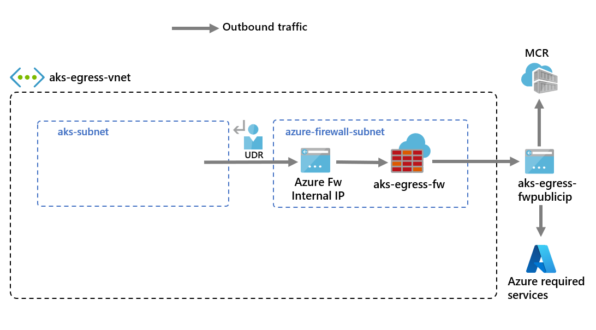

# Create AKS Private Cluster limiting network traffic with Azure Firewall

> Estimated Duration: 90 minutes

Deploying a private AKS cluster with no public IP addresses is a complex task and will take more time to do. This is as an "Advanced Lab" and it requires multiple Azure resources to be deployed and configured BEFORE deploying AKS. 

The scripts below demonstrate how to complete all steps to deploy a private AKS cluster and configure Azure Firewall with proper egress network rules set on it. The script blocks use the Azure CLI to deploy and configure the Azure resources.

> You need to fulfill these [requirements](environment-setup.md) to complete this challenge

## Learning resources

- [Limit network traffic with Azure Firewall in AKS](https://learn.microsoft.com/en-us/azure/aks/limit-egress-traffic)
- [Create a private AKS cluster](https://learn.microsoft.com/en-us/azure/aks/private-clusters)
- [Fully Private AKS Clusters Without Any Public IPs: Finally!](https://denniszielke.medium.com/fully-private-aks-clusters-without-any-public-ips-finally-7f5688411184)

## Create resource group and virtual network

Export required environment variables:

```bash
LOCATION=eastus2
RG=rg-aks-workshop-private-egress
```

Login to Azure and create resource group:

```bash
az login
az group create --name $RG --location $LOCATION
```

## Create AKS Virtual Network and subnet

Export environment variables required for Virtual Network:

```bash
VNET_NAME=aks-egress-vnet
VNET_PREFIX=10.42.0.0/16
AKS_SUBNET_NAME=aks-subnet
AKS_SUBNET_PREFIX=10.42.1.0/24
```

Create virtual network and subnet for AKS cluster:

```bash
az network vnet create -g $RG -n $VNET_NAME --address-prefix $VNET_PREFIX -l $LOCATION
az network vnet subnet create -g $RG -n $AKS_SUBNET_NAME --vnet-name $VNET_NAME --address-prefix $AKS_SUBNET_PREFIX
```

## Create and setup Azure Firewall

You need to configure Azure Firewall inbound and outbound rules. The main purpose of the firewall is to enable organizations to configure granular ingress and egress traffic rules into and out of the AKS cluster.



Export required variables

```bash
AZFW_SUBNET_PREFIX=10.42.2.0/24
# DO NOT CHANGE FWSUBNET_NAME - This is currently a requirement for Azure Firewall
AZFW_SUBNET_NAME=AzureFirewallSubnet
```

Create firewall subnet and public IP:

```bash
az network vnet subnet create -g $RG -n $AZFW_SUBNET_NAME --vnet-name $VNET_NAME --address-prefix $AZFW_SUBNET_PREFIX
```

Create a standard SKU public IP resource. This resource will be used as the Azure Firewall frontend address.

```bash
az network public-ip create -g $RG -n azfw-pip --sku Standard -l $LOCATION
```

Create firewall with DNS Proxy enabled. To leverage FQDN on network rules, we need DNS proxy enabled. When DNS proxy is enabled, the firewall listens on port 53 and forwards DNS requests to the DNS server specified above. This allows the firewall to translate the FQDN automatically (you may be prompted to enable azure firewall extension if not already enabled - this will take a few minutes).

```bash
az network firewall create -n azfw -g $RG -l $LOCATION --enable-dns-proxy true
```

Create IP firewall configuration (this command will take a few minutes):

```bash
az network firewall ip-config create -f azfw -n azfw-ipconfig -g $RG --public-ip-address azfw-pip --vnet-name $VNET_NAME
```

Get the Firewall Frontend IP and Private IP:

```bash
AZFW_IP=$(az network public-ip show -n azfw-pip -g $RG --query ipAddress -o tsv | tr -d '\r')
AZFW_PRIVATE_IP=$(az network firewall show -n azfw -g $RG --query ipConfigurations[0].privateIPAddress -o tsv | tr -d '\r')
```

### Create Route Table

Create a route with a hop to Azure Firewall. Azure automatically routes traffic between Azure subnets, virtual networks, and on-premises networks. To change any of Azure's default routing, you need to create a [route table](https://learn.microsoft.com/en-us/azure/aks/limit-egress-traffic#create-a-route-with-a-hop-to-azure-firewall).

Create an empty route table to be associated with a given subnet. The route table will define the next hop as the Azure Firewall created above. Each subnet can have zero or one route table associated to it.

```bash
az network route-table create -n aks -g $RG -l $LOCATION
```

Create 2 routes in the route table. This command creates a default route in the specified route table, directing all traffic to the Azure Firewall's private IP address, which acts as a virtual appliance. This ensures that all outbound traffic from the AKS cluster is routed through the Azure Firewall:

```bash
az network route-table route create -g $RG --name defaultRoute --route-table-name aks \
    --address-prefix 0.0.0.0/0 --next-hop-type VirtualAppliance --next-hop-ip-address $AZFW_PRIVATE_IP   
az network route-table route create --resource-group $RG --name internetRoute --route-table-name aks \
    --next-hop-type Internet --address-prefix "${AZFW_IP}/32"
```

### Add Firewall Rules

This section covers three network rules and an application rule you can use to configure on your firewall. You may need to adapt these rules based on your deployment. Each rule creation command may take ~2 minutes to complete.

- The first network rule allows access to port 9000 via TCP.
- The second network rule allows access to port 1194 and 123 via UDP. Both these rules will only allow traffic destined to the Azure Region CIDR in this lab.
- The third network rule opens port 123 to ntp.ubuntu.com FQDN via UDP. Adding an FQDN as a network rule is one of the specific features of Azure Firewall, so you'll need to adapt it when using your own options.
- The fourth, fifth and sixth network rules allow access to pull containers from GitHub Container Registry (ghcr.io), raw Github content (raw.githubusercontent.com) and Docker Hub (docker.io).

```bash
az network firewall network-rule create --resource-group $RG --firewall-name azfw --collection-name 'aksfwnr' \
--name 'apiudp' --protocols 'UDP' --source-addresses '*' --destination-addresses "AzureCloud.$LOCATION" \
--destination-ports 1194 --action allow --priority 100

az network firewall network-rule create --resource-group $RG --firewall-name azfw --collection-name 'aksfwnr' \
--name 'apitcp' --protocols 'TCP' --source-addresses '*' --destination-addresses "AzureCloud.$LOCATION" \
--destination-ports 9000

az network firewall network-rule create --resource-group $RG --firewall-name azfw --collection-name 'aksfwnr' \
--name 'time' --protocols 'UDP' --source-addresses '*' --destination-fqdns 'ntp.ubuntu.com' --destination-ports 123

az network firewall network-rule create --resource-group $RG --firewall-name azfw --collection-name 'aksfwnr' \
--name 'ghcr' --protocols 'TCP' --source-addresses '*' --destination-fqdns ghcr.io pkg-containers.githubusercontent.com \
--destination-ports '443'

az network firewall network-rule create --resource-group $RG --firewall-name azfw --collection-name 'aksfwnr' \
--name 'github' --protocols 'TCP' --source-addresses '*' --destination-fqdns raw.githubusercontent.com  --destination-ports '443'

az network firewall network-rule create --resource-group $RG --firewall-name azfw --collection-name 'aksfwnr' --name 'docker' \
--protocols 'TCP' --source-addresses '*' --destination-fqdns docker.io registry-1.docker.io production.cloudflare.docker.com \
--destination-ports '443'
```

Create application rule to allow HTTP and HTTPS traffic to AKS:

```bash
az network firewall application-rule create --resource-group $RG --firewall-name azfw --collection-name 'aksfwar' \
--name 'fqdn' --source-addresses '*' --protocols 'http=80' 'https=443' --fqdn-tags "AzureKubernetesService" \
--action allow --priority 100
```

### Associate the route table to AKS

To associate the cluster with the firewall, the dedicated subnet for the cluster's subnet must reference the route table created above.

```bash
az network vnet subnet update --resource-group $RG --vnet-name $VNET_NAME --name $AKS_SUBNET_NAME --route-table aks
```

## Create User identity

Create a managed identity:

```bash
ID_NAME=aksid
az identity create -n $ID_NAME -g $RG
ID_ID=$(az identity show -n $ID_NAME -g $RG --query id -o tsv | tr -d '\r')
```

Create a kubelet managed identity:

```bash
KUBE_ID_NAME=kubeletid
az identity create -n $KUBE_ID_NAME -g $RG
KUBE_ID_ID=$(az identity show -n $KUBE_ID_NAME -g $RG --query id -o tsv | tr -d '\r')
```

## Create AKS Private cluster

Now, you can deploy an AKS cluster into the existing virtual network. You will use the `userDefinedRouting` outbound type, which ensures that any outbound traffic is forced through the firewall and no other egress paths will exist.

Set the value for the subnet ID using the following command:

```bash
AKS_SUBNET_ID=$(az network vnet subnet show --resource-group $RG --vnet-name $VNET_NAME --name $AKS_SUBNET_NAME --query id -o tsv | tr -d '\r')
```

Create private AKS cluster with 1 node and outbound user defined routing (this may take 10-15 minutes):

```bash
PRIVATE_AKS=aks-private-gress

az aks create -g "$RG" -n "$PRIVATE_AKS" -l "$LOCATION" \
    --node-count 2 --generate-ssh-keys \
    --network-plugin azure \
    --enable-private-cluster \
    --outbound-type userDefinedRouting \
    --vnet-subnet-id "$AKS_SUBNET_ID" \
    --assign-identity "$ID_ID" \
    --assign-kubelet-identity "$KUBE_ID_ID"
```


## Deploy hello world application

Create command alias to be able to execute `kubectl` commands remotely using `az aks command invoke`:

```bash
alias remote="az aks command invoke -g $RG -n $PRIVATE_AKS -c "
```

Verify conectivity using this command:

```bash
remote "kubectl get nodes"
```

Run the following commands to create a namespace and deploy hello world application:

```bash
remote "kubectl create namespace helloworld"
remote "kubectl apply -f aks-helloworld-internal.yaml -n helloworld" --file manifests/aks-helloworld-internal.yaml
```

Run the following command to verify deployment and service has been created. Re-run command until pod shows a `STATUS` of **Running** and `EXTERNAL-IP` of the service shows a value.

```bash
remote "kubectl get all -n helloworld"
```

Assign the service IP value to an environment variable:

```bash
SERVICE_IP=$(remote "kubectl get svc aks-helloworld -n helloworld -o jsonpath='{.status.loadBalancer.ingress[0].ip}'" | tail -n +2 | tr -d '\r')
```

Attempt to curl service IP and notice it is not reachable:

```bash
curl -L http://$SERVICE_IP
```

Get application pod name:

```bash
POD=$(remote "kubectl get pod -n helloworld -o jsonpath='{.items[0].metadata.name}'" | tail -n +2 | tr -d '\r')
```

Confirm that the service is reachable from within the pod:

```bash
remote "kubectl exec -it $POD -n helloworld -- sh -c 'curl http://$SERVICE_IP'"
```

Attempt to curl public website and confirm it is not reachable:

```bash
remote "kubectl exec -it $POD -n helloworld -- sh -c 'curl http://www.microsoft.com'"
```

To expose this service outside the cluster you will need to use [Application Gateway Ingress Controller](https://learn.microsoft.com/en-us/azure/application-gateway/ingress-controller-expose-service-over-http-https)

## Cleanup

Delete resource group once done with this lab:

```bash
az group delete -n $RG
```
