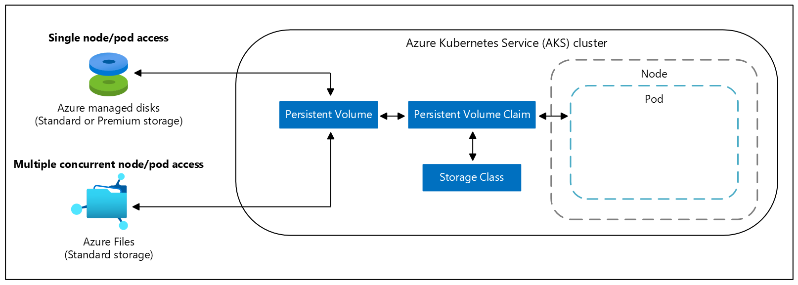
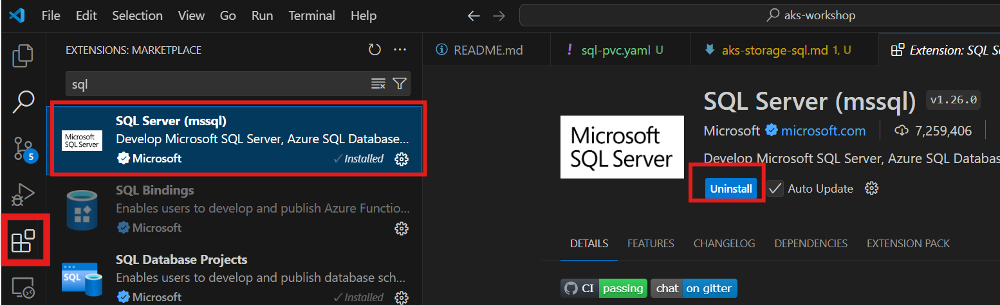

# Persistent Storage in AKS - Deploy SQL Server on AKS

> Estimated Duration: 60 minutes

## Prerequisites

You need to fulfill these [requirements](environment-setup.md) and [AKS Basic Cluster](aks-basic-cluster.md) to complete this exercise.

## Reference

[Storage options for applications in AKS](https://learn.microsoft.com/en-us/azure/aks/concepts-storage)
[Quickstart: Deploy a SQL Server container cluster on Azure](https://docs.microsoft.com/sql/linux/tutorial-sql-server-containers-kubernetes?view=sql-server-ver15)
[Best practices for storage and backups in AKS](https://learn.microsoft.com/en-us/azure/aks/operator-best-practices-storage)

## Persistent Volume Claims

A persistent volume claim (PVC) requests storage of a particular storage class, access mode, and size. The Kubernetes API server can dynamically provision the underlying Azure Storage resource if no existing resource can fulfill the claim based on the defined storage class.



## Choosing the appropriate storage type

| Use case                              | Volume plugin | Read/write once | Read-only many | Read/write many | Windows Server container support |
|---------------------------------------|---------------|-----------------|----------------|-----------------|----------------------------------|
| Shared configuration                  | Azure Files   | Yes             | Yes            | Yes             | Yes                              |
| Structured app data                   | Azure Disks   | Yes             | No             | No              | Yes                              |
| Unstructured data, file system operations | BlobFuse      | Yes             | Yes            | Yes             | No                               |

## Setup

In a terminal, export variables required for this lab (if not already exported):

```bash
INITIALS=abc
CLUSTER_NAME=aks-$INITIALS
RG=aks-$INITIALS-rg
```

If not already connected, connect to the cluster from your local client machine.

```bash
az aks get-credentials --name $CLUSTER_NAME -g $RG
```

## Create SA password secret

By default, the password must be at least eight characters long and contain characters from three of the following four sets: uppercase letters, lowercase letters, base-10 digits, and symbols.

```bash
SA_PASSWORD=<value>
```

Create a secret in Kubernetes named mssql that holds the `MSSQL_SA_PASSWORD` value, run the following command

```bash
kubectl create namespace sql
kubectl -n sql create secret generic mssql --from-literal=MSSQL_SA_PASSWORD="$SA_PASSWORD"
```

## Create storage class and persistent volume claim

Review the [manifests/sql-pvc.yaml](manifests/sql-pvc.yaml). It defines the storage class and the persistent volume claim. The manifest specifies the storage provisioner, parameters, and reclaim policy. The Kubernetes cluster uses this manifest to create the persistent storage.

The storage class provisioner is azure-disk, because this Kubernetes cluster is in Azure. The storage account type is `Standard_LRS`. The persistent volume claim is named `mssql-data`. The persistent volume claim metadata includes an annotation connecting it back to the storage class.

```bash
kubectl -n sql apply -f manifests/sql-pvc.yaml
```

The persistent volume is automatically created as an Azure storage account, and bound to the persistent volume claim. Verify the persistent volume claim, the persistent volume and storage class have been created:

```bash
kubectl get sc,pvc,pv -n sql
```

## Create the deployment

Review the [manifests/sql-deployment.yaml](manifests/sql-deployment.yaml) file. The manifest defines a deployment, including a container based on the SQL Server container image.

In the security context, we define the `fsGroup` with the value `10001`, which is the Group ID (GID) for the `mssql` group. This value means that all processes of the container are also part of the supplementary GID `10001` (`mssql`). The owner for volume `/var/opt/mssql` and any files created in that volume will be GID `10001` (the `mssql` group).

> **NOTE:** By using the `LoadBalancer` service type, the SQL Server instance is accessible remotely (via the Internet) at port 1433.

```bash
kubectl -n sql apply -f manifests/sql-deployment.yaml
```

View the status of the deployment:

```bash
kubectl get deployment,service,pod -n sql
```

Get the SQL pod name:

```bash
POD_NAME=$(kubectl -n sql get pod -o custom-columns=:metadata.name | awk NF)

Verify the pod is `RUNNNING`:

```bash
kubectl -n sql describe pod $POD_NAME
```

Connect to the pod:

```bash
kubectl exec $POD_NAME -n sql -it -- /bin/bash
```

You can see the username as `mssql` if you run `whoami`. `mssql` is a non-root user.

```txt
whoami
```

## Connect to the SQL Server instance

From Visual Studio Code click on the Extensions toolbar icon. Type SQL and you then click on "SQL Server (mssql) form the search results, then click on Install:



Get the SQL Server service IP:

```bash
kubectl get svc mssql-deployment -n sql -o jsonpath='{.status.loadBalancer.ingress[0].ip}'
```

From Visual Studio Code click on the "SQL Server" extension toolbar icon, then click on Add Connection. When prompted enter the IP as the Server Name, click Enter for the default Database name. Click on SQL Login and provide the `sa` User name and password.


## Cleanup

Delete the namespace from AKS:

```bash
kubectl delete namespace -n sql
```
