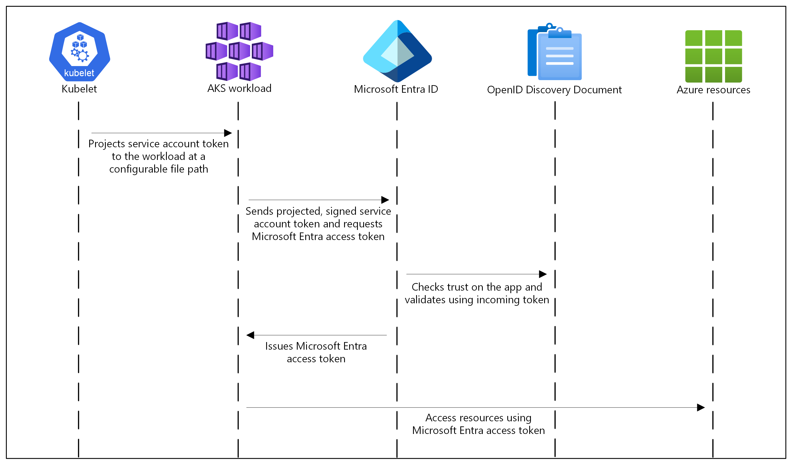

# Using Microsoft Entra Workload ID with AKS

> Estimated Duration: 60 minutes
>> **NOTE:** You need to fulfill these [requirements](environment-setup.md) and [AKS Basic Cluster](aks-basic-cluster.md) to complete this exercise.

In this lab we will complete the following tasks:

1. Enable the cluster for Entra Workload Identity
2. Create the Entra cluster identities
3. Configure an Entra enabled target for testing
4. Write the code to test your Workload Identity setup
5. Deploy the application to your AKS cluster and demonstrate its operation

## How Worload Identity works

For more information see: [Workload Identity Overview](https://learn.microsoft.com/en-us/azure/aks/workload-identity-overview)

Workloads deployed on an Azure Kubernetes Services (AKS) cluster require Microsoft Entra application credentials or managed identities to access Microsoft Entra protected resources. Microsoft Entra Workload ID integrates with the capabilities native to Kubernetes to federate with external identity providers.

In this security model, the AKS cluster acts as the token issuer. Microsoft Entra ID uses OpenID Connect to discover public signing keys and verify the authenticity of the service account token before exchanging it for a Microsoft Entra token. Your workload can exchange a service account token projected to its volume for a Microsoft Entra token using the Azure Identity client library.



## Setup

In a terminal, export variables required for this lab (if not already exported):

```bash
INITIALS=abc
CLUSTER_NAME=aks-$INITIALS
RG=aks-$INITIALS-rg
```

If not already connected, connect to the cluster from your local client machine.

```bash
az aks get-credentials --name $CLUSTER_NAME -g $RG
```

## Enable the cluster for Entra Workload Identity

Enable the Azure Workload Identity managed add-on and OIDC issuer on the target cluster.

```bash
az aks update -g $RG -n $CLUSTER_NAME \
--enable-oidc-issuer \
--enable-workload-identity
```

### Create the Entra managed and Federated identities

Now that the cluster is enabled with the OIDC Issuer and Azure Workload Identity, we can create our Managed Identity and Service Account and then federate those identities.

Retrieve the OIDC Issuer URL

```bash
export AKS_OIDC_ISSUER="$(az aks show -n $CLUSTER_NAME -g $RG --query "oidcIssuerProfile.issuerUrl" -o tsv)"
```

Create the managed identity

```bash
MANAGED_IDENTITY_NAME=testmi
az identity create --name $MANAGED_IDENTITY_NAME --resource-group $RG
```

Get identity client ID

```bash
export USER_ASSIGNED_CLIENT_ID=$(az identity show --resource-group $RG --name $MANAGED_IDENTITY_NAME --query 'clientId' -o tsv)
```

Create the kubernetes namespace

```bash
NAMESPACE=workload-identity-test
kubectl create ns $NAMESPACE
```

Create a service account with Workload Identity enabled and specifying the client id:

```bash
cat <<EOF | kubectl apply -f -
apiVersion: v1
kind: ServiceAccount
metadata:
  annotations:
    azure.workload.identity/client-id: ${USER_ASSIGNED_CLIENT_ID}
  labels:
    azure.workload.identity/use: "true"
  name: ${MANAGED_IDENTITY_NAME}-sa
  namespace: ${NAMESPACE}
EOF
```

Create the federated identity credential between the managed identity, the service account issuer, and the subject

```bash
az identity federated-credential create \
--name $MANAGED_IDENTITY_NAME-federated-id \
--identity-name $MANAGED_IDENTITY_NAME \
--resource-group $RG \
--issuer ${AKS_OIDC_ISSUER} \
--subject system:serviceaccount:$NAMESPACE:$MANAGED_IDENTITY_NAME-sa
```

## Configure an Entra enabled service for testing

For the purposes of this test, one of the best and easiest sample targets is Azure Key Vault. Create an Azure Key Vault and a Secret that we can try to access from our cluster. **The key vault name must be unique**:

```bash
KEY_VAULT_NAME=$INITIALS-kv
```

Create a key vault for testing:

```bash
az keyvault create --name $KEY_VAULT_NAME --resource-group $RG --enable-rbac-authorization
```

Assign yourself the RBAC **Key Vault Secrets Officer** role so that you can create a secret in the new key vault:

```bash
export KEYVAULT_RESOURCE_ID=$(az keyvault show --resource-group "$RG" \
    --name "$KEY_VAULT_NAME" \
    --query id \
    --output tsv)
USER_EMAIL=$(az ad signed-in-user show --query userPrincipalName --output tsv)
az role assignment create --assignee "$USER_EMAIL" \
    --role "Key Vault Secrets Officer" \
    --scope $KEYVAULT_RESOURCE_ID
```

Create a Key Vault secret:

```bash
az keyvault secret set --vault-name $KEY_VAULT_NAME --name "Secret" --value "Hello from key vault"
```

Assign the **Key Vault Secrets User** role to the user-assigned managed identity that you created previously. This step gives the managed identity permission to read secrets from the key vault:

```bash
export IDENTITY_PRINCIPAL_ID=$(az identity show \
    --name "$MANAGED_IDENTITY_NAME" \
    --resource-group "${RG}" \
    --query principalId --output tsv)

az role assignment create \
    --assignee-object-id "${IDENTITY_PRINCIPAL_ID}" \
    --role "Key Vault Secrets User" \
    --scope "$KEYVAULT_RESOURCE_ID" \
    --assignee-principal-type ServicePrincipal
```

### Deploy test application to validate Workload Identity setup

Now we have our cluster setup properly and have created a test target for an Entra authenticated call. Let's deploy an app to call the key vault. In this case we'll use a dotnet application, but you can use any language you prefer that is supported by the [Microsoft Authentication Libraries](https://learn.microsoft.com/en-us/azure/active-directory/develop/reference-v2-libraries).

```bash
cd src/keyvault-console-app
```

We need to get this app into a container, so we need to build the image. You can do this locally, but to be safe from any cpu architecture mismatches, lets use the Azure Container Registry to build. You should have an existing registry from the [AKS Basic Cluster](aks-basic-cluster.md).

```bash
ACR_NAME=$(az acr list --resource-group $RG --query '[0].name' -o tsv)
IMAGE_NAME=wi-kv-test
```

Build the image. This uploads the source code and builds the image remotely using ACR:

```bash
az acr build -t $IMAGE_NAME -r $ACR_NAME .
```

Get the ACR FQDN for later use:

```bash
ACR_FQDN=$(az acr show -n $ACR_NAME -o tsv --query loginServer)
```

Now we need to do is create a pod that uses our federated service account with our test app loaded. Set the service account name we created earlier:

```bash
SA_NAME=testmi-sa
```

Next create a pod that uses the service account with workload identity enabled:

```bash
cat <<EOF | kubectl apply -f -
apiVersion: v1
kind: Pod
metadata:
  name: wi-kv-test
  namespace: ${NAMESPACE}
  labels:
    azure.workload.identity/use: "true"
spec:
  serviceAccountName: ${SA_NAME}
  containers:
    - image: ${ACR_FQDN}/${IMAGE_NAME}
      name: wi-kv-test
      env:
      - name: KEY_VAULT_NAME
        value: ${KEY_VAULT_NAME}
      - name: SECRET_NAME
        value: Secret    
  nodeSelector:
    kubernetes.io/os: linux
EOF
```

Check the pod status and confirm pod is **Running**:

```bash
kubectl get pods -n $NAMESPACE
```

Now check the logs

```bash
kubectl logs -f wi-kv-test -n $NAMESPACE
```

Sample Output:

```txt
Retrieving your secret from abc-kv.
Your secret is 'Hello from key vault'.
```

You now have a cluster enabled with the OIDC Issuer and the Azure Workload Identity managed add-on with a deployed application using a Kubernetes Service Account that has been federated to an Azure Managed Identity to access a secret in an Azure Key Vault!

## Cleanup

Before moving to the next lab, do not forget to delete running pod and namespace:

```bash
kubectl delete pod wi-kv-test -n $NAMESPACE
kubectl delete ns $NAMESPACE
```

### Delete Azure resources

Delete keyvault:

```bash
az keyvault delete -n $KEY_VAULT_NAME -g $RG
```

Delete fedreated credentials:

```bash
az identity federated-credential delete -n $MANAGED_IDENTITY_NAME \
  --identity-name $MANAGED_IDENTITY_NAME-federated-id -g $RG
```

Delete managed identity:

```bash
az identity delete -n $MANAGED_IDENTITY_NAME -g $RG
```

### Disable workload identity (optional)

This command it is included for reference, however we recommend keeping workload identity for subsequent labs (unless epxlicitely recommended to be removed in a subsequent lab).

```bash
az aks update --resource-group "${RG}" --name "${CLUSTER_NAME}" --disable-workload-identity
```
